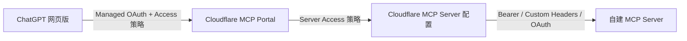

最近摸索了一下，怎么在chatgpt网页版接入自建mcp

## 最终链路



这条链路有两层独立认证：

| 链路                  | 认证用途                                     | 常见方式                           |
| --------------------- | -------------------------------------------- | ---------------------------------- |
| ChatGPT → MCP Portal  | 判断哪个用户可以连接 Portal、看到哪些 Server | Cloudflare Access Managed OAuth    |
| MCP Portal → 自建 MCP | 让 Cloudflare 代表用户或管理员访问上游 MCP   | Bearer、Custom Headers、上游 OAuth |

ChatGPT 中只配置 Portal URL。自建 MCP 的地址和 Bearer token 保留在 Cloudflare
配置中，不交给 ChatGPT。

## 前置条件

开始前准备：

- 一个已经接入 Cloudflare 的有效域名。
- 一个 Cloudflare Zero Trust 组织。
- 至少一种已经配置好的身份提供方。
- 一个公网 HTTPS MCP endpoint，例如 `https://memory.example.com/mcp`。
- ChatGPT 账号或工作区允许启用 Developer mode 和自定义 MCP 连接。

自建 MCP 需要满足：

- 使用远程 HTTP transport，优先使用 Streamable HTTP。
- 能完成 MCP `initialize`。
- 能通过 `tools/list` 返回名称、描述和 JSON Schema 完整的工具。
- 私有数据有 Bearer、OAuth 或其他有效认证。
- endpoint 使用有效 HTTPS 证书。

Cloudflare MCP Portal 只接收远程 HTTP MCP。仅支持 stdio 的 MCP 需要先部署成远程
HTTP 服务。

## 第一步：先验证自建 MCP

安装并启动 MCP Inspector：

```powershell
npx @modelcontextprotocol/inspector@latest
```

在 Inspector 中选择 `Streamable HTTP`，填写：

```plain text
<https://memory.example.com/mcp>
```

上游使用 Bearer 时，添加请求头：

```plain text
Authorization: Bearer <UPSTREAM_MCP_TOKEN>
```

至少完成以下检查：

1. `initialize` 成功。
2. `tools/list` 返回预期工具。
3. 每个工具都可以使用代表性参数调用。
4. 无结果和非法参数能返回可理解的错误。
5. 未携带认证信息时无法读取私有数据。

如果 Inspector 无法连接，先修复 MCP transport、Schema 或认证问题，再配置
Cloudflare。

## 第二步：准备 Access Allow 策略

进入 Cloudflare Dashboard：

```plain text
Zero Trust → Access controls → Policies
```

创建一条可复用的 `Allow` 策略。个人部署可以按邮箱限制，团队部署可以按身份提供方
用户组限制。

后续需要把这条策略同时关联到：

1. MCP Portal 的 Access Application。
2. Portal 中每个 MCP Server 的 Access Application。

同一批用户访问 Portal 和 Server 时，可以复用同一条 Allow 策略。


## 第三步：把自建 MCP 添加到 AI Controls

进入：

```plain text
Zero Trust
→ Access controls
→ AI controls
→ MCP servers
→ Add an MCP server
```

填写：

- `Name`：例如 `cloudmind`。
- `Server ID`：可选，建议使用稳定的小写标识。
- `HTTP URL`：填写完整地址，例如 `https://memory.example.com/mcp`。

根据上游 MCP 选择认证方式：

- 无认证：只适用于真正公开的 MCP。
- OAuth：上游 MCP 已实现受支持的 OAuth 流程。
- Custom Headers：Bearer token、API Key 或其他静态请求头。

Bearer 示例：

```plain text
Header name: Authorization
Header value: Bearer <UPSTREAM_MCP_TOKEN>
```

给这个 MCP Server 关联前面创建的 Allow 策略，然后选择 `Save and connect server`。
Cloudflare 会连接上游，读取 tools、prompts 和 resources。

继续下一步前确认 Server 状态为 `Ready`。以下状态需要先处理：

- `Waiting`：Cloudflare 仍在连接或同步上游。
- `Error`：URL、认证、协议或上游响应存在错误。
- `Sync Required`：上游能力或管理员认证需要重新同步。


## 第四步：创建 MCP Portal

进入：

```plain text
Zero Trust
→ Access controls
→ AI controls
→ Add MCP server portal
```


配置：

- Portal 名称：例如 `cloudmind`。
- Custom domain：例如 `ai.example.com`。
- MCP servers：选择刚才添加的 Server。
- Tools 和 prompts：默认全部开放，也可以关闭不希望客户端看到的能力。
- Access policy：关联前面创建的 Allow 策略。

上游 MCP 支持 OAuth 时，可以配置 `Require user auth`：

- 开启：每个用户使用自己的上游 OAuth 身份。
- 关闭：Portal 使用添加 Server 时保存的管理员凭据。

Bearer 和 Custom Headers 场景由 Cloudflare 使用已保存的静态凭据访问上游，
`Require user auth` 主要影响支持 OAuth 的上游 Server。

创建完成后的 MCP 地址是：

```plain text
<https://ai.example.com/mcp>
```

通过 Dashboard 创建 Portal 时，Cloudflare 通常会同时创建所需 DNS。通过 API 或
Terraform 创建时，需要自行添加一个开启代理的 CNAME：

```plain text
ai.example.com → gateway.agents.cloudflare.com
```

## 第五步：检查两份 Access Application

进入：

```plain text
Zero Trust → Access controls → Applications
```

Cloudflare 会创建两类应用：

| 应用类型     | 控制范围                                    |
| ------------ | ------------------------------------------- |
| `mcp_portal` | 谁可以连接 Portal URL                       |
| `mcp`        | 谁可以在 Portal 中看到并使用这个 MCP Server |

确认 Portal 和每个 Server 都关联了 Allow 策略，并且当前登录 ChatGPT 的用户能够匹配
这两条策略。

Portal 有策略、Server 没有策略时，用户完成登录后会看到：

```plain text
No allowed servers available, check your Zero trust policies
```

这个错误说明 Portal 登录已经成功，但当前用户没有任何可用的上游 MCP Server。

## 第六步：在 ChatGPT 网页版添加 Portal

在 ChatGPT 中执行：

1. 打开 `Settings`。
2. 进入 `Security and login`。
3. 开启 `Developer mode`。
4. 打开 `Settings → Plugins`。部分账号界面可能显示为 Apps 或 Connectors。
5. 点击加号，创建自定义连接。
6. 填写名称和简短说明。
7. MCP URL 填写 Portal 地址：`https://ai.example.com/mcp`。
8. 创建连接并完成 Cloudflare Access 浏览器授权。
9. 检查 ChatGPT 发现的工具列表。
10. 新建对话，从工具菜单启用这个连接。

Developer mode 是否显示取决于 ChatGPT 账号能力和工作区策略。团队工作区还需要管理员
允许用户创建或使用自定义连接。


## 常见问题

### `No allowed servers available`

检查：

- Portal Access Application 是否有 Allow 策略。
- 每个 MCP Server Access Application 是否有 Allow 策略。
- 当前用户是否同时匹配这两层策略。
- 上游 Server 是否仍为 `Ready`。

### Server 长时间处于 `Waiting` 或 `Error`

检查：

- MCP URL 是否包含正确的 `/mcp` 路径。
- 上游是否支持 Streamable HTTP。
- Bearer 或 Custom Headers 是否有效。
- `initialize` 和 `tools/list` 是否能通过 MCP Inspector。
- 上游是否拒绝 Cloudflare 这类代理客户端。

### Portal 没有发起登录

检查：

- Portal 是否关联 Access 策略。
- Managed OAuth 是否启用。
- Portal 域名是否被其他 Worker route、Page Rule 或自定义 hostname 干扰。
- ChatGPT 中填写的 URL 是否以 `/mcp` 结尾。

###

## 安全边界

- 不要把上游 Bearer token 填入 ChatGPT 或公开教程截图。
- 不要把 token 写入 Git、聊天记忆、工具返回或错误详情。
- 优先把静态凭据保存在 Cloudflare MCP Server 的 Custom Headers 中。
- 定期轮换上游凭据，并在轮换后重新同步 Server。
- Portal 的 Server Access 策略控制用户能否通过 Portal 看到 Server。
- 自建 MCP 的直接 URL 仍要保留 Bearer、OAuth 或其他有效认证。
- 写操作应在 MCP Server 内继续执行权限检查，不能只依赖客户端提示词。

## 官方资料

- [Cloudflare MCP server portals](https://developers.cloudflare.com/cloudflare-one/access-controls/ai-controls/mcp-portals/)
- [Cloudflare Managed OAuth](https://developers.cloudflare.com/cloudflare-one/access-controls/applications/http-apps/managed-oauth/)
- [Cloudflare Secure MCP servers](https://developers.cloudflare.com/cloudflare-one/access-controls/ai-controls/secure-mcp-servers/)
- [OpenAI Connect and test your plugin](https://developers.openai.com/plugins/deploy/connect-chatgpt)
- [OpenAI Build an MCP server](https://developers.openai.com/plugins/build/mcp-server)
- [MCP Inspector](https://modelcontextprotocol.io/docs/tools/inspector)
